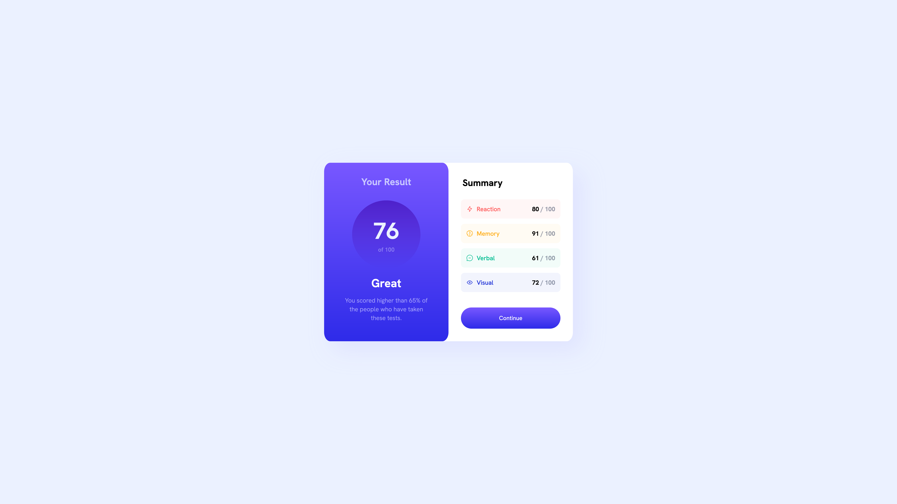
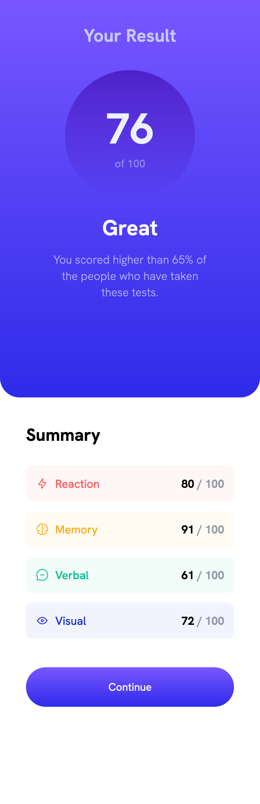

# Frontend Mentor - Results summary component solution

This is a solution to the [Results summary component challenge on Frontend Mentor](https://www.frontendmentor.io/challenges/results-summary-component-CE_K6s0maV). Frontend Mentor challenges help you improve your coding skills by building realistic projects.

## Table of contents

- [Overview](#overview)
  - [The challenge](#the-challenge)
  - [Screenshot](#screenshot)
  - [Links](#links)
- [My process](#my-process)
  - [Built with](#built-with)
  - [What I learned](#what-i-learned)
  - [Continued development](#continued-development)

## Overview

My second challenge on FrontEnd Mentor. Simple project to get used to with css.

### The challenge

Users should be able to:

- View the optimal layout for the interface depending on their device's screen size
- See hover and focus states for all interactive elements on the page

### Screenshot




### Links

- Solution URL: [Solution](https://github.com/Maksym-Paselsky/results-summary-component-main)
- Live Site URL: [Live URL](https://maksym-paselsky.github.io/results-summary-component-main/)

## My process

I create html structure and then I use css-grid for main two sections, stylized them and finish with mobile version via media query.

- Semantic HTML5 markup
- CSS custom properties
- Flexbox
- CSS Grid

### What I learned

Didn't know about aspect ratio before 🧐

```css
.proud-of-this-css {
  width: 55%;
  max-width: 200px;
  aspect-ratio: 1/1;
  border-radius: 50%;
}
```

### Continued development

I want to dig into css-grid more and figure out proper usage of rem/em's to enable more smooth responsivness. CSS-grid and positioning is priority!📝
